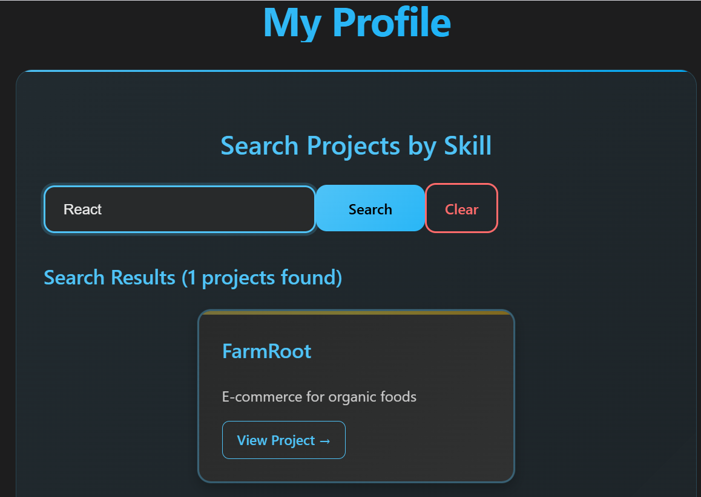
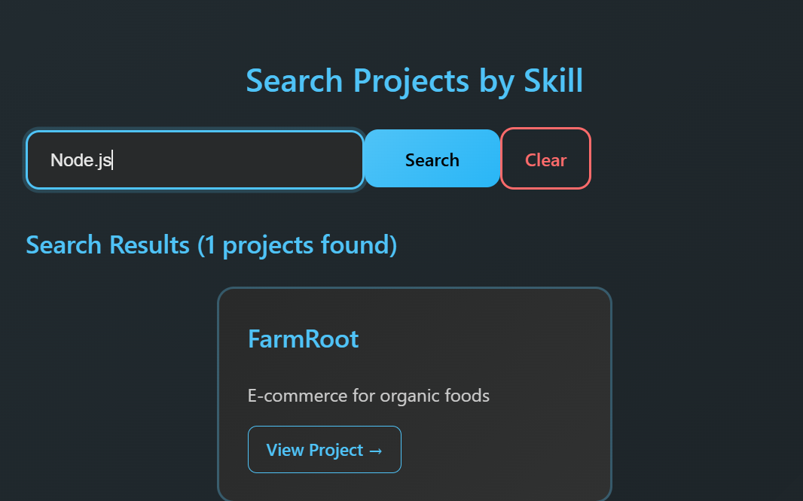
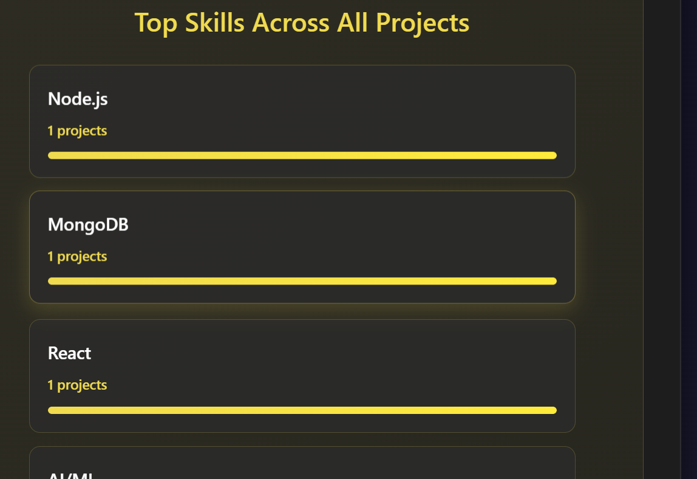

# Predusk Assignment – Backend & AI Intern  

An assignment project for **Predusk Technology Pvt. Ltd.** recruitment.  
It includes backend APIs built with **Node.js + Express + MongoDB**, and a frontend built with **React + Vite**.  

---

## 🚀 Live Links  
- **Frontend (Vercel)**: [https://predusk-assignment-inky.vercel.app/](https://predusk-assignment-inky.vercel.app/)  
- **Backend (Render)**: [https://predusk-assignment-2-5jgk.onrender.com/](https://predusk-assignment-2-5jgk.onrender.com/)  

---

## 📂 Project Structure  
   Predusk_Assignment/
     │── backend/ # Node.js + Express + MongoDB backend
     │── frontend/ # React + Vite frontend
     │── README.md


---

## ⚙️ Features  

### 🔹 Backend (Track A)  
- Create Profile  
- Get Profile by ID  
- Get All Profiles  
- Fetch Top Skills across profiles  
- Search profiles by skill  

### 🔹 Frontend (React + Vite)  
- Profile display with details (**name, email, skills, projects**)  
- Search profiles by skills  
- Top Skills visualization with progress bars  
- Modern **vanilla CSS design**  
- Responsive layout  

---

## 🛠️ Tech Stack  
- **Frontend**: React + Vite, Vanilla CSS  
- **Backend**: Node.js, Express.js, MongoDB, Mongoose  
- **Deployment**: Vercel (Frontend) & Render (Backend)  

---

## 📌 API Endpoints  

### Profiles  
- `POST /api/profiles` → Create a new profile  
- `GET /api/profiles` → Get all profiles  
- `GET /api/profiles/:id` → Get profile by ID  

### Skills  
- `GET /api/query/skills/top` → Fetch top skills across profiles  
- `GET /api/query/skills/search?name=JavaScript` → Search profiles by skill  

---

## ⚡ Setup (Local)  

### 1️⃣ Backend  
```bash
cd backend
npm install
npm start

```
## Runs at: http://localhost:5000

### 2️⃣ Frontend
cd frontend
npm install
npm run dev

## Screenshots
  
  
  


## 📜 Note

This project was created as part of the Predusk Technology Pvt. Ltd. Internship Assessment (Track A).

